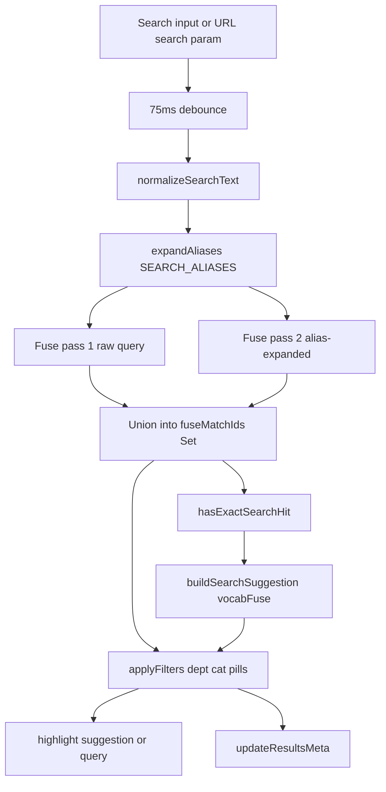

# Search Guide

This document explains how search works in the RH Foster CSR Reference app. It is for maintainers and content editors. CSRs use search on branch pages only; the root branch picker does not run search.

## Purpose

After a CSR selects a branch, the branch page loads all FAQ cards (shared service, delivery, and general data plus that branch's local cards) and filters them in the browser. Search is static and offline after first load. There is no server-side search API.

## What CSRs see

- Results update live as they type (75ms debounce).
- Fuzzy matching finds cards even with common typos.
- When the typed text has no exact substring hit on any card but Fuse still found matches, the results meta can show a "Did you mean …?" suggestion.
- Clicking the suggestion fills the search box and re-runs search.
- Title and description highlights use the suggestion text when a suggestion is active, so corrected words are marked on cards.
- Department tabs (All, Service, Delivery, General) and category pills narrow the list. Pills hide categories that have no matches for the current search.
- When searching inside one department, matching cards from other departments appear under "Also in other departments".
- Deep links open a branch page with search pre-filled, for example: `machias/index.html?search=delivery`.

## Script load order

Branch pages load scripts in this order:

1. `shared/branches.js`
2. `shared/data-service.js`
3. `shared/data-delivery.js`
4. `shared/data-general.js`
5. Branch `overrides.js` (Beals loads Machias overrides instead)
6. `shared/vendor/fuse.min.js`
7. `shared/core.js`

If Fuse fails to load or fails to initialize, search falls back to alias-expanded substring matching. A console warning is logged in that case.

## Data flow

## Fuse configuration

Logic lives in `shared/core.js`. Settings below match the current code.

| Setting | Value |
|---------|--------|
| Library | Fuse 7.0.0 at `shared/vendor/fuse.min.js` |
| Card index | `new Fuse(FAQ_ALL, …)` built once at init |
| `threshold` | `0.42` |
| `minMatchCharLength` | `2` |
| `ignoreLocation` | `true` |
| `distance` | `100` |
| `useExtendedSearch` | `false` |

Weighted keys on each card:

| Key | Weight |
|-----|--------|
| `title` | 0.45 |
| `tags` | 0.25 |
| `questions` | 0.15 |
| `desc` | 0.10 |
| `category` | 0.03 |
| `script` | 0.02 |

On each search pass, matching card ids are stored in `fuseMatchIds` (a `Set`). `searchMatches(card)` uses `fuseMatchIds.has(card.id)` for O(1) membership checks while filtering.

Note: `cardMap` (id to card object) exists in `core.js` but is not used by search. The O(1) search path is `fuseMatchIds`, not `cardMap`.

## Aliases and normalization

### Normalization

`normalizeSearchText`:

- lowercases text
- strips accents (NFKD)
- replaces non-alphanumeric characters with spaces
- collapses whitespace

### Aliases

`SEARCH_ALIASES` in `core.js` maps CSR synonyms and common misspellings to richer query text (for example `lp` to `propane`, `co` to `carbon monoxide`).

Replacements use whole-word boundaries so short aliases such as `co` or `lp` do not match inside longer words like `cold` or `help`.

### Dual Fuse pass

1. Pass 1: Fuse search on the raw typed query (catches direct fuzzy matches).
2. Pass 2: Fuse search on the alias-expanded query (skipped if expansion did not change the query).
3. Results are unioned and deduplicated by card id into `fuseMatchIds`.

If Fuse returns no hits, `fuseMatchIds` is set to `null` and `searchMatches` uses the substring fallback against `buildSearchIndex`.

### Substring fallback index

`buildSearchIndex` joins and normalizes:

- title, desc, category, department
- resolved tags
- urgencyLabel, stopCondition
- questions, script

A card matches if the expanded query is a substring of that index, or every token of the expanded query appears in the index.

## Did you mean

1. A vocabulary list is built once from card title, desc, category, and tags (words longer than 2 characters).
2. A separate `vocabFuse` instance (threshold `0.4`) corrects individual misspelled tokens.
3. A suggestion is set only when Fuse found matches **and** `hasExactSearchHit` is false for the typed query.
4. Results meta pattern: `0 results for "typed". Did you mean [suggestion]? · N results`
5. Clearing the search box or clicking clear resets `searchSuggestion`.

Clicking the suggestion button fills the search box with the corrected text, clears the suggestion flag, and re-runs Fuse plus filters.

## How filters interact with search

| Department tab | Search query | Result layout |
|----------------|--------------|---------------|
| All | empty | Flat list of all renderable cards. No grouping. |
| All | active | Grouped by department: Service, then Delivery, then General. Only sections with matches are shown. |
| Specific dept | empty | Cards from that department only. Category pills apply. |
| Specific dept | active | Primary section: matching cards from the active department (category pills apply). Then cross-dept matches under "Also in other departments" (category pills do not apply to cross-dept). |

Delivery area map cards are sorted first within Delivery sections via `sortAreaCardsFirst`.

Category pills are rebuilt from cards that match the current search (when a query is active), so empty categories are hidden.

Empty state: if no cards remain visible after filtering, the empty state message is shown.

## Making search better

When editing FAQ content:

- Prefer explicit `tags` on every new card. Do not rely on `TAG_BY_CATEGORY` / `TAG_BY_ID` defaults in `core.js` when you can set tags on the card itself.
- Put distinctive customer language in `title`, `desc`, and `tags` (highest Fuse weights).
- Add entries to `SEARCH_ALIASES` in `core.js` for recurring CSR synonyms or misspellings.
- Do not put search logic in data files.

After content edits, smoke-test on a branch page:

1. Exact term that should hit the edited card
2. A known typo (for example `woter leek` if testing did-you-mean)
3. An alias (`lp`, `co`)
4. Nonsense (`xyz`) should show empty state
5. Deep link `?search=` with a known term
6. Click a "Did you mean" suggestion when it appears

## Related files

| File | Role |
|------|------|
| `shared/core.js` | Search logic, aliases, Fuse init, filters, highlights, deep link |
| `shared/core.css` | Search UI, `.search-suggestion-btn`, mark styles, pills |
| `shared/vendor/fuse.min.js` | Vendored Fuse 7.0.0 (offline) |
| `shared/data-service.js` | Service FAQ cards |
| `shared/data-delivery.js` | Delivery FAQ cards |
| `shared/data-general.js` | General FAQ cards |
| `*/overrides.js` | Branch local cards, overrides, suppressions (included in `FAQ_ALL`) |
